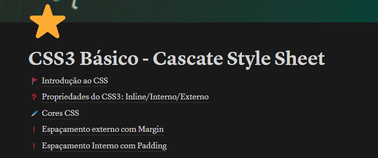

# Projeto com README
Um projeto de teste com um arquivo README no GITHUB 🪼

## Tecnologias utilizadas
- HTML
- CSS
- JS

## Como Utilizar

1 - Clone pro o projeto
'''
git clone <url>
'''

2 - Acesse a pasta do projeto
'''
cd repositorio-com-readme
'''